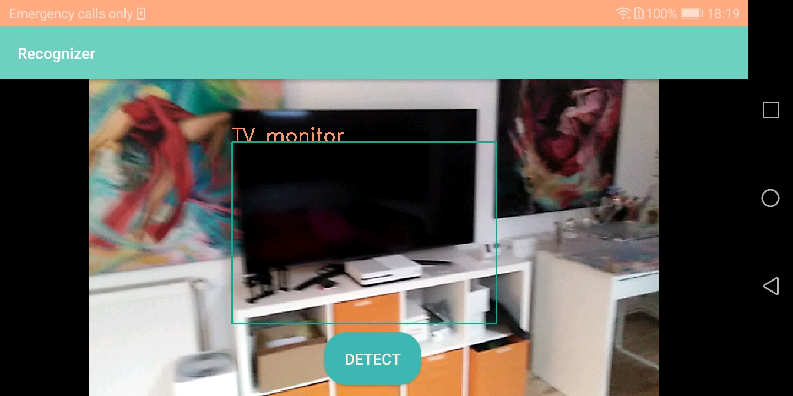
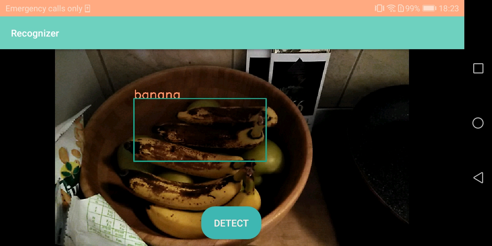

# Object Recognizer

This is an Android Studio App that recognizes objects and people using the camera of your phone.

In order for it to work on your phone, you have to copy the dnns folder on your phone's internal storage.

  
  
  

